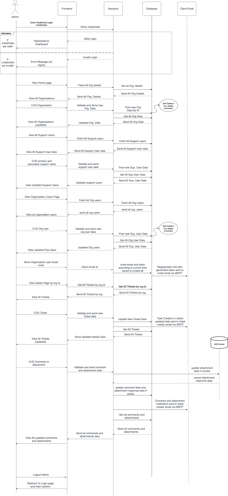

<p align="center">
    
    <br/>
    <br/>
    <b>Wizdesk: Elevate Your CRM Experience with Integration, Efficiency, and Versatility.</b>
</p>


[](https://nodejs.org "Go to Node.js homepage")
[](https://reactjs.org "Go to React homepage")

[](https://github.com/apiwizlabs/wizdesk/issues)
[](https://github.com/apiwizlabs/wizdesk/stargazers)


[](https://twitter.com/getapiwiz)
[](https://www.linkedin.com/company/apiwizio/)

[**APIwiz is proud to make Wizdesk public for Contributions**](https://www.apiwiz.io/)  
Wizdesk is the gateway to seamlessly integrate with Jira, offering a cost-effective open-source alternative with robust issue tracking, efficient communication, and real-time notifications

## 🤔 Why Wizdesk?

Wizdesk stands out with its ability to seamlessly integrate with Jira, offering a cost-effective open-source alternative with robust issue tracking, efficient communication, and real-time notifications.

## ✨ Features

- 🎫 Raise tickets for any issue type
- 🔄 Streamlines client-organization communication
- 📧 Generates real-time email notifications for most events
- 📥 Imports tickets from existing Jira workspace
- 🌟 Open-source JIRA alternative with versatile applications, and it's free!


## 🚀 Getting Started
To getting started in local development environment, just fork the project git repository and follow the below steps:

Execute the shell script `setup.sh` to automatically setup for you or follow the below steps

```bash
  git clone https://github.com/<your_github_username>/wizdesk.git
  cd wizdesk
  npm install
  npm start
```
Navigate to `/public/config.js` and update the following variables accordingly
1. `PUBLIC_KEY` : This is a randomly generated rsa key used for encrypting passwords, you can get one yours from https://cryptotools.net/rsagen. Paste the Public key in this config and Private Key in the Backend config
2. `GOOGLE_OAUTH_CLIENT_ID`: This is a google oauth client id, you can get yours after [google oauth setup](https://support.google.com/cloud/answer/6158849?hl=en)
3. `API_BASE_URL`: The Base Url where your local server should be running
4. `BASE_URL`: The Base Url for your local UI server


Make sure the [Server side code](./Server/) is also setup, before running `npm start`

## Sequence Diagram




## User Flow
# Support and Admin Users

**Who are support users?** <br>
These are users who solve or deal with customer bugs, issues etc. 

**Who are organisation specific support users and what does it mean to Wizdesk?** <br>
- These are users who have certain organisations assigned to them. 
- They get notified when a customer creates a ticket or imports tickets.
- They also get notified when anyone comments or changes the status of a ticket that is assigned to them.

## 1. **Authentication**

### 1.1 Sign Up and Log In

1. Using google OAuth you can both signup and login at the same time i.e if you are a first time user you will be both signed up and logged in if not then you will be logged in.
2. Incase you want to be able to login without google OAuth then you can use the reset password option and create a password for yourself. 
after which you can use this password to login without using google OAuth.

### 1.2 Logout

1. Click on the Logout button that is present in the right end of the Navbar.
2. You will be redirected back to the login page upon successful logout.

## 2. Organisations

once logged in, you will be redirected to the organisations dashboard where you can see a list of organisations in a card format. 

click on an organisation card to be redirected to the organisation’s respective ticket dashboard.

### 2.1 Create an Organisation

1. Here, you can create a new organisation by clicking on the “Create Organisation” Button.
    

- The **ID Key Name** field represents the word that you would see as a prefix before each tickets ID Example: if ID Key Name was “NEW” then each ticket created would have Unique Sequential ID’s such as NEW-1, NEW-2 etc.
(PS: any improvements for the algorithm used to generate the sequential ID’s are welcome)

- **Email Domains** represent the email domains that the organisation uses in our case it would be “itorix.com”. 
If there are multiple domains then you can give it in a comma separated fashion as shown in the placeholder. 
Keep in mind that while inviting client users their email domain should be included in the list. else, the invite will not be sent.

***Reasons you could get an exception or be unable to create an organisation:***

- keep in mind that all fields are mandatory with the exception of the “Upload Logo” field
- The name of the organisation and workspace name should be **unique** for every organisation.
- At least one support user needs to be present
- the ID Key Name needs to be a unique word and cannot exceed 4 characters.

### 2.2 Update an Organisation

1. Click on the pencil icon present in the top right corder of the organisation card for updating an organisation

### 2.3 Delete an Organisation - Only Admins

1. Click on the trash icon present on the top right corner of the organisation card then confirm if a prompt is shown.

 

## 3. Tickets

### 3.1 Create A Ticket

1. You will see a button in the left top of the listed tickets page called “Create Ticket”
    
2. After clicking on the button a form will be shown. Proceed to fill the details.  
3. The description text Input and the comments text input support basic markdown. 
4. Once Ticket details are filled click the “Create Ticket” Button.

Note: Adding attachments that have large file sizes such as videos may require longer to create or update a ticket. 

Check this link out for markdown syntax help: 

[Markdown Cheat Sheet | Markdown Guide](https://www.markdownguide.org/cheat-sheet/)

### 3.2 Importing Tickets from JIRA

1. To import multiple tickets from your JIRA workspace you need to click on the Import/Export dropdown then click on the import option. 
2. Go to your JIRA workspace and download or export your existing JIRA tickets as an excel by selecting the “Export Excel CSV (all fields)”. 
The steps are Filters < Advanced Issue Search < Export < Export Excel CSV (all fields)
    
    
3. If you want the attachments to get imported as well then please follow steps 4 and 5, else go to step 6.
4.  To import attachments you need to setup an API Key using the following steps:
    1. Log in to [https://id.atlassian.com/manage-profile/security/api-tokens](https://id.atlassian.com/manage-profile/security/api-tokens).
    2. Click **Create API token**.
    3. From the dialog that appears, enter a memorable and concise **Label** for your token and click **Create**.
    4. Click **Copy to clipboard**, then paste the token to your script, or elsewhere to save:
    
    [https://images.ctfassets.net/zsv3d0ugroxu/1RYvh9lqgeZjjNe5S3Hbfb/155e846a1cb38f30bf17512b6dfd2229/screenshot_NewAPIToken](https://images.ctfassets.net/zsv3d0ugroxu/1RYvh9lqgeZjjNe5S3Hbfb/155e846a1cb38f30bf17512b6dfd2229/screenshot_NewAPIToken)
    
    Note:
    
    - For security reasons it isn't possible to view the token after closing the creation dialog; if necessary, create a new token.
    - You should store the token securely, just as for any password.
5. Enter the API Key, email ID associated with your jira account and jira workspace domain name into this form then click on “import with attachments” button < select exported excel file. 


1. Incase you don’t want to import your tickets with attachments then just click on “Skip this step and Import” button then select your exported CSV file.
2. Your designated support user/s will be notified about the imported tickets.

### 3.2 View, Update and Delete A Ticket


1. To ***View a ticket***, Click on a listed ticket to view all the ticket fields.
2. To ***update a ticket***, first click on the listed ticket you wish to edit, then make the necessary changes and finally click on the "Update Ticket" button.
3. To ***delete a ticket***, click on the trash icon present in the “Actions” column of each ticket.

### 3.3 Copy and Share a Ticket


1. Click on the link icon that is present in the “Actions” column of your desired ticket. If link copied then you will see a pop up toast saying the tickets link has been copied to your clipboard.

    (OR)

1. To copy the link of a ticket, start by clicking on the ticket whose link you want to copy. This will open the ticket modal, where you can manually copy the URL without closing the modal.

***NOTE:*** The shorter “ID” column for all tickets can be used for better track-ability.

### 3.4 Download All Tickets


1. Click on the “Download Tickets” button which is found in the tickets listing page.
2. Once you click on the "Download Tickets" button, a CSV file containing all the ticket details will be generated and downloaded to your local system.

### 3.5 Filter Tickets

1. Click on the dropdown buttons then select the filters that you would like applied to the tickets. The ticket list will get filtered accordingly.

    

### 3.6 Custom Views

these are custom filters that get applied according to a preselected set of filters.

1. click on the Custom Views button to view your existing views. click on add a view to then create a customised view. make sure to give it a name that is relevant!

## 4. Profile

1. you can view your profile by clicking on your email that is present in the top right of the Navbar
2. you can update or add your contact details such as your mobile number or edit your name.

## 5. Manage Users

### 5.1 Lock Users - Admin Only

1. locking a user means that the locked user will not be able to login or perform any actions unless unlocked.

    
2. To lock a user you need click on the Manage Users button which is present in the organisations dashboard then click on the “Lock User” button present on the user’s card.
3. Perform the same steps to unlock a user.

    

### 5.2 View Invite Details

1. To view the invites sent you have to click on the “Manage Users” button present in the home page then switch tab to Invited Users.
2. You can view the email of the person who was invited, if the invitee has successfully signed up or not, organisation of the invitee and the email of the person who invited them

***NOTE: Kindly note that our APIwiz support team is available to assist you with any issues or queries that may arise while using our documentation. Please do not hesitate to contact us if you require any further assistance beyond what is provided in the documentation. We are more than happy to help you.***


## Community Support

For general help using Wizdesk, refer to the below discussion
- [Github](https://github.com/apiwizlabs/wizdesk/discussions) - For bug reports, help, feature requests


## Contributing
All code contributions, including those of people having commit access, must go through a pull request and be approved by a maintaner before being merged. This is to ensure a proper review of all the code.

Kindly read our [Contributing Guide](./CONTRIBUTING.md) to familiarize yourself with Wizdesk's development process, how to suggest bug fixes and improvements, and the steps for building and testing your changes.

## Security

For security issues, kindly email us at security@apiwiz.com instead of posting a public issue on Github

## Follow Us
Join our growing community! Checkout out our official [Blog](https://www.apiwiz.io/resources/blogs). Follow us on [Twitter](https://twitter.com/getapiwiz), [Linkedin](https://www.linkedin.com/company/apiwizio/)


## Thanks to all Contributors 🙏🏼
<a href="https://github.com/apiwizlabs/wizdesk/graphs/contributors">
  
<a>
