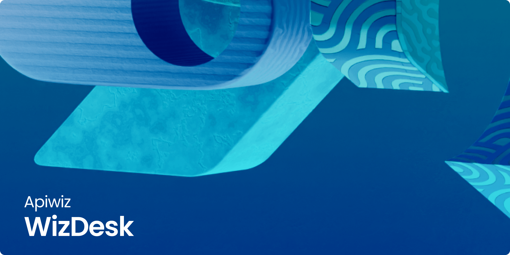

    
     
     
    <b>Wizdesk: Elevate Your CRM Experience with Integration, Efficiency, and Versatility.</b>

[**APIwiz is proud to make Wizdesk public for Contributions**](https://www.apiwiz.io/)  
Wizdesk is the gateway to seamlessly integrate with Jira, offering a cost-effective open-source alternative with robust issue tracking, efficient communication, and real-time notifications

## 🚀 Getting Started
This is the backend code for [Wizdesk](../), <- Click here to go to UI setup  

### ✨ PreRequisites

## Community Support

For general help using Wizdesk, refer to the below discussion
- [Github](https://github.com/apiwizlabs/wizdesk/discussions) - For bug reports, help, feature requests

## Contributing
All code contributions, including those of people having commit access, must go through a pull request and be approved by a maintaner before being merged. This is to ensure a proper review of all the code.

Kindly read our [Contributing Guide](../CONTRIBUTING.md) to familiarize yourself with Wizdesk's development process, how to suggest bug fixes and improvements, and the steps for building and testing your changes.

## Security

For security issues, kindly email us at security@apiwiz.com instead of posting a public issue on Github

## Follow Us
Join our growing community! Checkout out our official [Blog](https://www.apiwiz.io/resources/blogs). Follow us on [Twitter](https://twitter.com/getapiwiz), [Linkedin](https://www.linkedin.com/company/apiwizio/)

## Thanks to all Contributors 🙏🏼
<a href="https://github.com/apiwizlabs/wizdesk/graphs/contributors">
  
<a>
